# 计算机网络概论

Hello，大家好。今天一起来学习下，无论是前端还是后端，计算机必须要使用的部件，计算机网络。学好计算机网络不言而喻，我们每日在互联网上交流免不了网络，而提供坚实稳定的网络稳定性和高效性能则是各家都在追求的优化。

[Course Link](https://juejin.cn/course/bytetech/7219155491984212024/section/7219155491992600613)

[Course PPT]((https://bytedance.feishu.cn/file/YwPAbwrB4o4SX9xStO3cqRPsn2d))

## 3. 网络基础

locale: 38:00

---

### 网络组成部分

- 主机：客户端和服务端

- 路由器

- 网络协议

### 网络的网络

- 比奇堡和小区网络：本地网络

- 本金和上海分店+比奇堡：三个本地网络节点的网络

- 全国通信网络：本地网络的网络

- 区域网络、城域网和广域网

### 电路交换 & 分组交换

电路交换：例如打电话，容易线路占据，有人占线别人就连不了，无法使用该线路。顾客也必须连接才能下单，别人连线不上就无法下单。

分组交换：例如传真，不会进行电路连接，也不会预留资源、带宽。结合到新的队列后，

### 网络分层

五层(从低到高)：物理层、链路层、网络层、运输层、应用层 

每一层都有着对自身层级的封装，这些封装对于上一层而言几乎都是黑盒的。对于上一层的调用者来说，无需关心下一层中调用关系。

核心思想 各层互不干涉，分清职责55，对于上一层无需关心下一层的具体实现。

- 快递员不关心包裹内容

- 卡车司机不关心车厢拉的是什么

- 高速公路不关心开的什么车

### 协议：

 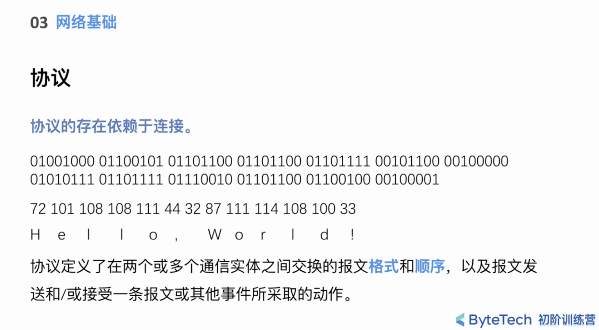

### 标头和载荷：

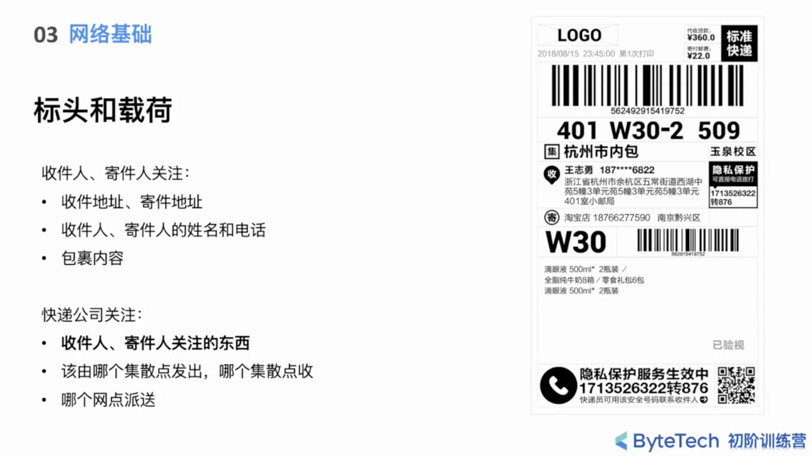

## 4. Web 应用

### HTTP协议

- 头部

- 响应

### 队头堵塞 Head of Line Blocking

HTTP 连接模型

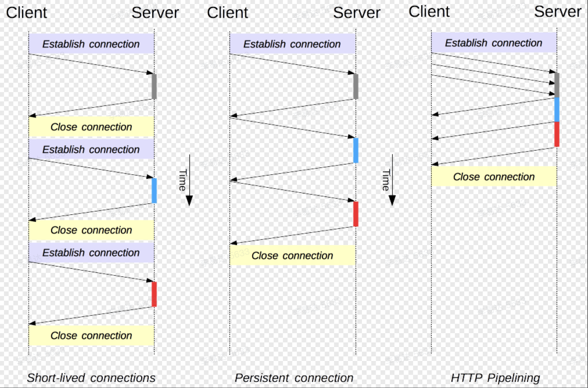

### Web 应用

#### HTTP 1.1: 无法多路复用

```js
// main.js
console.log('hello world')
```

```css
/* style.css */
body{
    color: red;
}
```

```html
body{
    console.log('hello world');
    color:red;
}
```

#### HTTP2 : 帧

```js
request=style.css,content='body {'
request=main.js, content='console.log('hello world')'
request=style.css,content=' color:red;'
request=style.css,content='}'
```

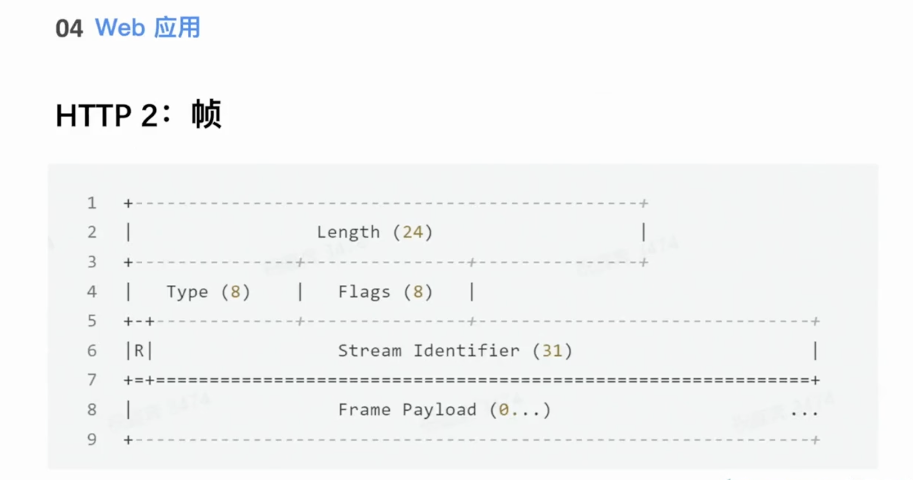

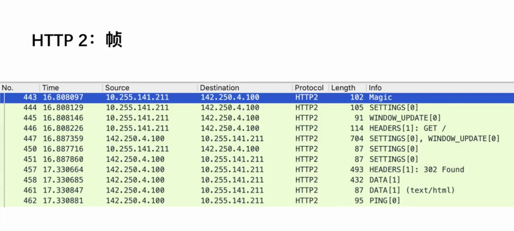

Frame 解析：

- 前三个字节：载荷长度

- 第四个字节：类型

- 第五个字节：类型对应的Flags

- 第六到第九字节：
  
  - 第 1 位：保留位
  
  - 第 2-32 位：流ID

- 随后的 8192 字节：载荷

#### 帧带来的额外好处：

- 调整响应传输的优先级

- 头部压缩

- Server Push

### HTTP2：队头堵塞，但是在 TCP 上

- TCP包 0：包含了（包含了 style.css 的第1行内容）的 HTTP2 的帧

- TCP包 1：包含了（包含了 main.js 的全部内容）的 HTTP2 的帧

- TCP包 2：包含了（包含了 style.css 的第2行内容）的 HTTP2 的帧

- TCP包 3：包含了（包含了 style.css 的第3行内容）的 HTTP2 的帧

会有TCP握手 TLS握手 双倍延迟。

这个帧由四个TCP 包承载。若网络波动，TCP 1 丢包。由于TCP的机制， 她会丢包重传。TCP并不会把 2和 3 交给  H .TCP 必须先告诉服务器没有收到序号1的包，服务器重新发送一次序号为2的包，且浏览器收到后，才会把 1 2 3的数据包交给hdpr。即使 http2 知道 TCP包1 丢包不影响 数据包 2 3 ，但是还是得完整不丢包。

### HTTP2: 3 RTT启动

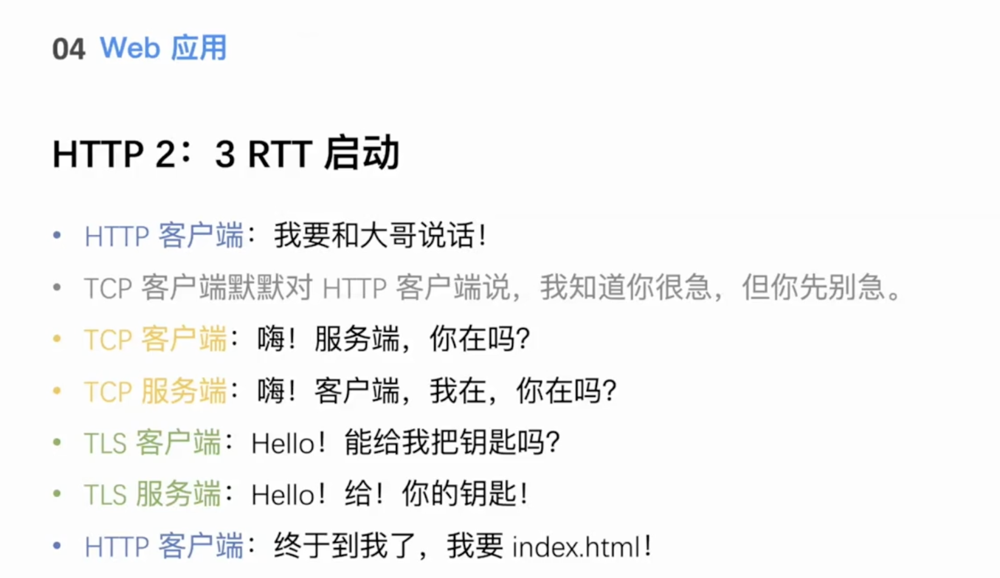

要经历HTTP 连接，要经过三个 RTT（Run-Trip Time）,三个RTT 分别是 TCP连接建立需要一个RTT，TLS连接建立需要两个RTT。 TLS 1.2 及以下需要两个RTT。TLS 1.3以上可以实现首次1RTT，二次 0 RTT。TCP不知道自己运送的是TLS报文，无法通过改造进行优化。

### HTTP3：QUIC

QUIC 将 TLS 做成自成的一部分，解决了TCP和TLS需要各自握手的问题。又吸取了HTTP2 中流的概念，在QUIC 中提供互相独立的流，解决TCP队头堵塞问题。实现首次连接 1RTT，后续连接0 RTT的特性。

因为现有网络协议都对 TCP 和 UDP 提供了良好的支持，设计新协议普及应用要很久。

可以承载除了 HTTP协议以外的应用层协议来提供支持（虽然现在还没有）。UDP不靠谱（丢包不管，没有拥塞控制，没有顺序保证，应用层给多少数据就往里发多少数据，时间一概不闻不问）

但是QUIC靠谱，在TCP基础上实现了同样的拥塞控制和丢包重传的特性，确保了QUIC传数据的顺序和稳定性、完整性。

### HTTP3：QUIC - 1RTT

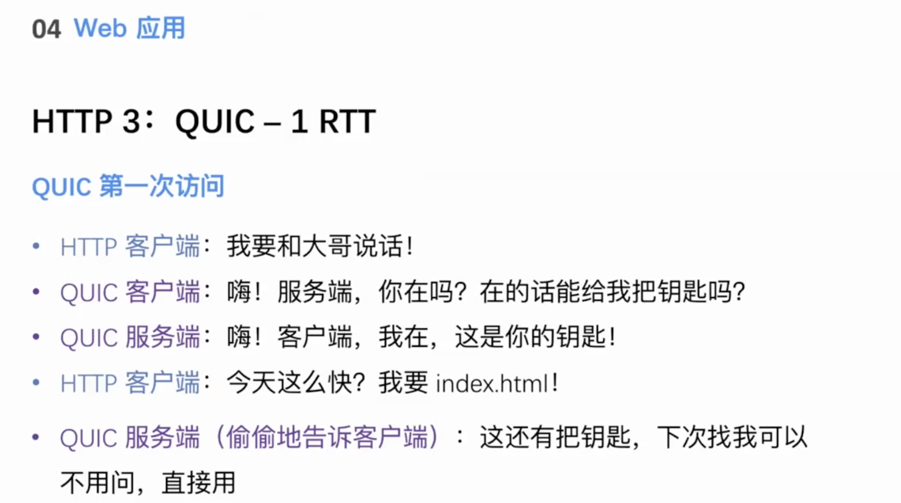

首次连接，HTTP客户端第一次与服务端发起连接，QUIC客户端先发起连接请求，请求服务端给一把钥匙，加密密钥。QUIC服务在收到请求后，会把证书和加密秘钥一起发送给客户端。QUIC客户端随后告知HTTP客户端，可以发送HTTP报文，后续的通信都使用加密秘钥进行加密。

QUIC服务端也会告诉QUIC客户端，这里有新的密钥，不用问。

QUIC 相比原先的TCP，把原先的TCP和TLS的握手组合起来了，因此可以实现1RTT的连接。

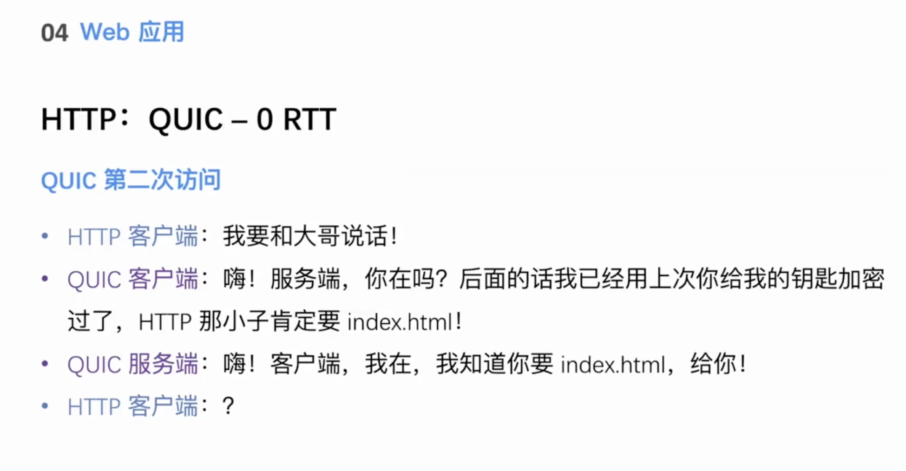

当同一个客户端再次发起 HTTP请求时，QUIC 客户端会使用上次的QUIC服务端偷偷给的密钥，直接把HTTP请求加密发送给服务端，这样服务端就可以直接响应客户端的请求。这种方式就可以实现0RTT连接。 

#### HTTP小结：

HTTP中，请求的第一行为起始行，响应的第一行为状态行，请求和响应第二行开始到第一空行为止，为头部。第一空行之后的部分为正文。

在HTTP1.0中，请求和结束的默认行为是关闭TCP连接， 这个行为可以通过设计Connection 头部来修改。但这种模型行为效率太低，在1.1 中，改成了不关闭连接。

HTTP2中，首次提供了多部私有，头部压缩、帧，大幅缓解了队头堵塞的问题。但不能解决TCP队头堵塞问题。

HTTP3使用了基于UDP重新设计的QUIC协议，避免了TCP中的队头堵塞。并将TLS 内置进QUIC，降低了握手延迟，可以实现首次1RTT，二次0RTT的连接。到HTTP3时，能在HTTP上进行的优化方案基本都已经实现了。

---

### CDN（Content Delivery Network）：

另外影响浏览器性能的情况 单服务器：

- 物理极限（北京到上海和美国到上海）

- 同个页面发送多个相同信息，要经过多个网络节点，不共享。浪费钱。

- 单个服务器承载能量有限，例如大型活动就会崩溃。

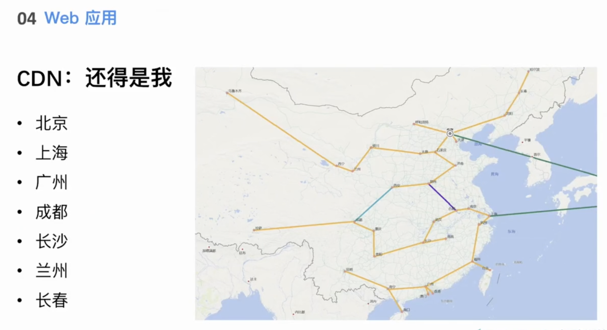

通常 CDN 提供商会在服务范围内按地理位置进行服务器的分布。如一个CDN 选择在 北京、上海、广州、成都、长沙、兰州、长春做出自己的CDN服务器，全国的用户都可以在很低的路由跳之内获取响应内容。

 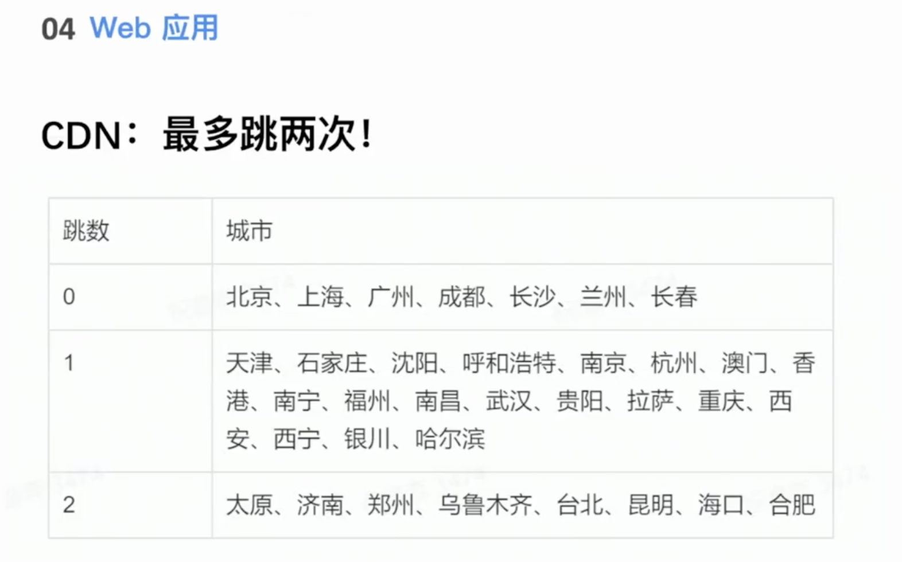

### CDN: DNS劫持

- 域名解析一般由网站自己处理

- 要加速的域名则重定向到CDN厂商的域名解析服务处理

- CDN厂商根据来源确定最近的CDN服务器的IP

- 用户直接访问最近的CDN服务器

> 任波：Google 8.8.8.8

告诉DNS要要查的域名，DNS告诉你对应的IP。

例如，在昆明的小明访问douyin的视频，其URL是video.douyin.com. 流程如下：

浏览器向本地DNS查询域名对应的IP地址，向上一层的DNS服务器发送查询请求，DNS服务器发现这个域名应该交给douyin解析，于是交给了douyin运营解析服务器。douyin运营解析服务器收到请求后，发现域名是CDN加速域名，于是没有返回IP，返回了新的DNS地址，新DNS地址是CDN管理的，本地DNS又向CDN的DNS发起了请求，CDN的DNS根据用户IP，确定离得最近的CDN是广州的CDN，于是返回了广州CDN的IP。浏览器最终和广州的服务器进行连接，而不是北京的服务器。

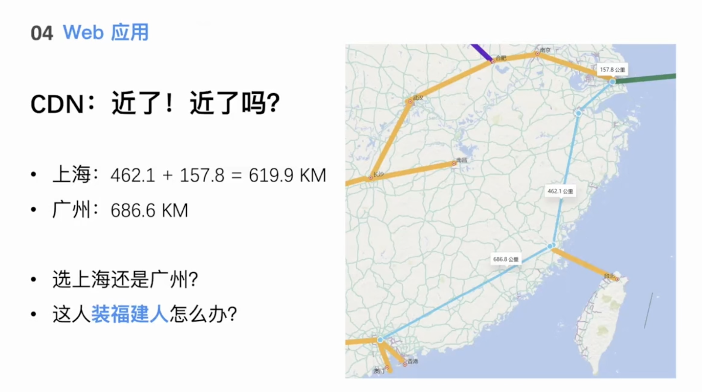

如何选择CDN服务器，一种简单的策略，根据DNS查询来源IP地理位置，选择就近的CDN服务器。

例如在福州的小红，选择上海的路径会比广州近。但是最近不一定是最好，每多一个路由器转发节点，就要多一些延迟。路由器接收需要时间，处理分组也需要时间，转发分组也需要时间。 这个耗时相比光纤2/3的光速显然要更长。

另一种情况，用户不使用本地DNS服务商提供的DNS，指定另外的DNS。例如指定Google 的DNS 8.8.8.8。这时基于地理位置的DNS重定向可能适得其反了。除此之外，CDN当时的负载，用户到CDN 链路的负载，都可能影响最终访问速度和质量。

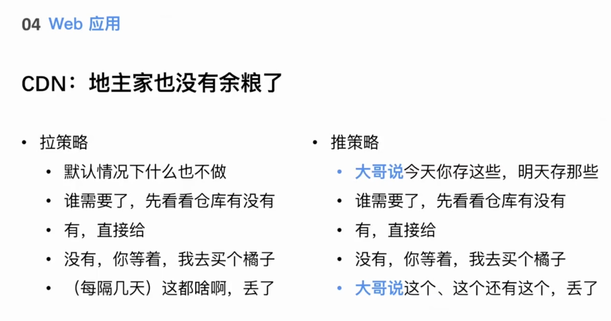

拉策略和推策略

推策略：（网站对CDN的拷贝）

例如等到福州的小红要看视频，但是广州的CDN没有，再去北京的CDN拷贝一份，备份到广州的CDN。而且每隔一段时间就自行清除策略，例如LRU，以腾出空间。

拉策略：

用户进行对CDN商的拷贝，例如电影网站，刚上映的电影肯定热门，于是网站在电影上映前，期间负载较低时，向CDN服务器推送最新电影的拷贝，在电影上映时，全国用户才能以最快速度获取刚上映的电影。对一些冷门电影则可以使用拉策略，按需进行分发。

### WebSocket

- 有状态的持久连接

- 服务端可以主动推送消息

- 用WebSocket发送消息延迟比HTTP 低

建立 WebSocket 是在HTTP的基础上升级而来，先使用 HTTP协议，双方协商后再使用WebSocket。应用只需要关心来自服务端的消息，以及根据自己的需要，发送给服务端的消息即可。

WebSocket应用在创建一个WebSocket连接后，监听服务端发来的消息，适时向服务端发送消息，完成应用的目的即可。

#### WebSocket：示例

**服务端代码**

```js
// WebSocket Server. 
// Content：服务端发来什么，就给他发回去
const { WebSocketServer } = require('ws');

const wss= new WebSocketServer({port:8080});

wss.on('connection',function connection(ws){
    // 有新连接时监听来自客户端的信息
    ws.on('message',function message(data){
        // 打印收到的信息，再把信息原封不动的发回给客户端
        console.log('received: %s',data);
        ws.send(data);
    });
});    
```

**客户端代码**

```js
// WebSocket Client. 
// Content：当收到服务端发来的消息，就给他打印出来
const WebSocket= require('ws');

const ws= new WebSocket('ws://localhost:8080');

ws.on('open',function open(){
    // 当连接建立时，向服务端发送一条信息
       ws.send(‘something’);
});

ws.on('message',function message(data){
    // 当收到来自服务端的消息时，打印出来
    console.log('received: %s',data);
});    
```

### WebSocket 和 HTTP的关系：升级！

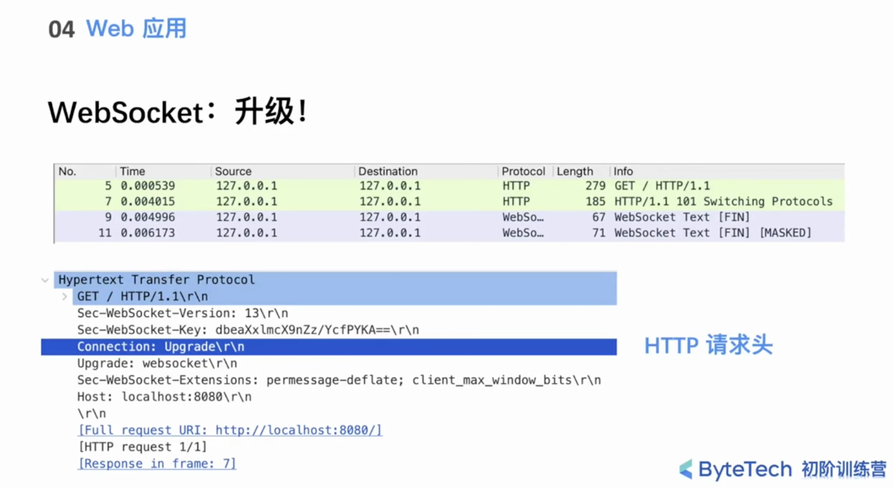

上图展示，WebSocket如何从HTTP升级而来的。WebSocket前有一个HTTP的交互，客户端发送概率请求，这里的Pass 是斜杠，还有额外的Header告诉服务器，客户端向把请求升级为WebSocket，例如这里的 `Connection: Upgrade` 以及 `Upgrade: websocket`.

**HTTP 响应**

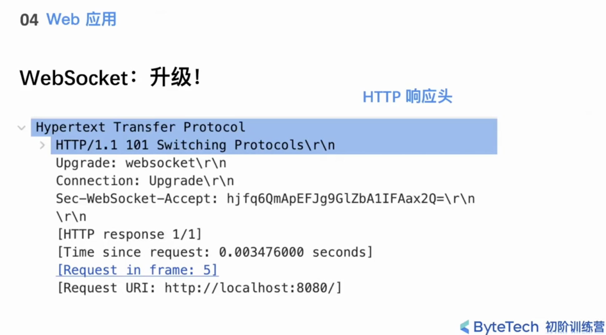

服务端在接收这个概率请求后，决定升级这个 WebSocket连接。便会向客户端响应 `101 Switching Protocols` 这个状态。客户端在接收到服务端发送的 101代码之后，后续就可以用 WebSocket 协议发送消息了。操作口从HTTP 切换成了 WebSocket.

#### WebSocket：发送消息

**WebSocket 客户端消息**

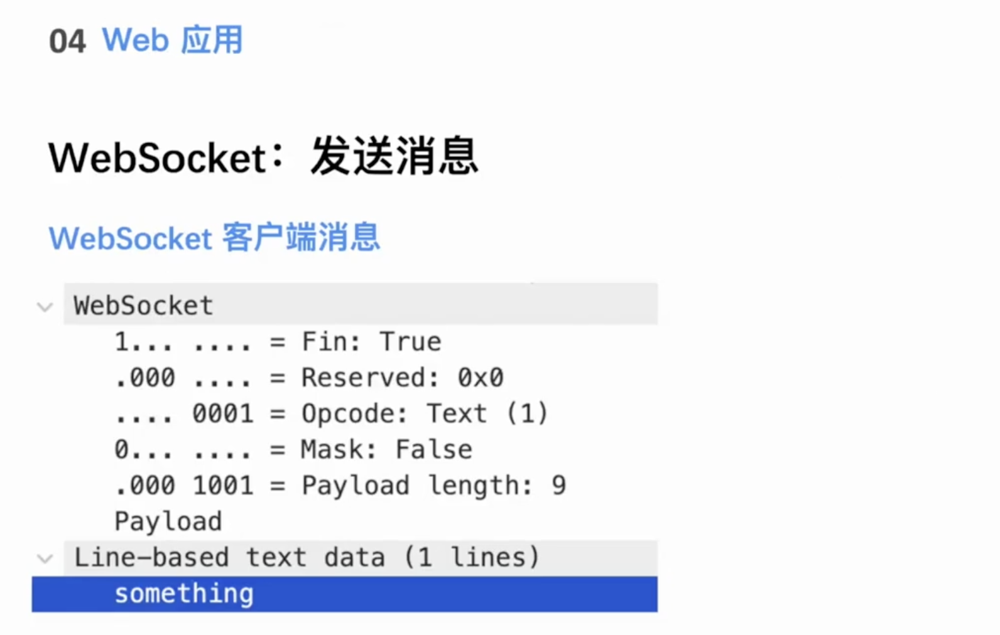

连接建立后，客户端先发送一串字符串‘something’。

**WebSocket 服务端消息**

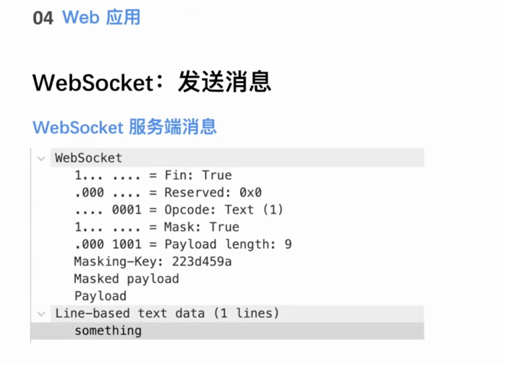

服务端把收到的消息重新发给了客户端。

对于应用层来说，无需关系其中的 WebSocket 部分，只需关心最后的 **Line-based text data** 即可。而且在应用层，一般是以事件的方式将新到达的数据交给回调函数的，也不需要解析。WebSocket 还可以传输二进制文件。

### 小结：

- HTTP 1 2 3的演进历史

- CDN 解决了 HTTP协议之外的问题

- WebSocket 从 HTTP 协议升级而来 

## 05 网络安全

HTTP WebSocket UDP 都是明文的。明文会导致很多行为无法通过网络进行。

### 网络安全：三要素

- 机密性：攻击者无法获知通信内容(即使获取通信内容，也无法理解实际含义)

- 完整性：攻击者对内容进行篡改时能被发现

- 身份验证：攻击者无法伪装成通信双方的任意一方与另一方通信（需要确认身份）

### 对称加密和非对称加密

- 对称加密：加密、解密用同样的密钥（只有私钥）

- 非对称加密：加密、解密使用不同的密钥（公钥和私钥），而且**公钥加密只能用私钥解密、私钥加密只能用公钥解密**

### 密码散列函数（哈希函数）

- 输入：任意长度的内容

- 输出：固定长度的哈希值

- 性质：找到两个不同的输入使之经过密码散列函数后有相同的哈希值，在计算上是不可能的。

并不会使用HASH进行加密，经过hash加密后，任意长度都会变成固定的哈希值，原始输入包含的数据已经丢失了。从一个哈希值是不能反推出输入的。

### 网络安全：机密性

- 加密需要加密算法和密钥等信息（统称**秘密信息**）

- 网络上明文的，不安全

怎么在不安全的信道交换加密信息？加密算法和密钥

### 网络安全：完整性和身份验证

完整性和身份验证相互关联。

- 蟹老板向银行发起转账请求

- 银行需要确认
  
  - 这个请求真的是蟹老板发起的（不是他人伪装）
  
  - 目标账户和转账金额没有被篡改

#### 为了实现三个特性（机密性、完整性和身份验证）需要同时使用：**对称加密**、**非对称加密**、**密码散列函数**

### 如何实现机密性

- 已知：网络是明文的

- 如果双方可以通过明文通信商量出秘密信息，那么攻击者也可以知道

- 所以想要通过明文通信交换秘密信息，通信双方需要先有秘密信息

### 如何实现完整性

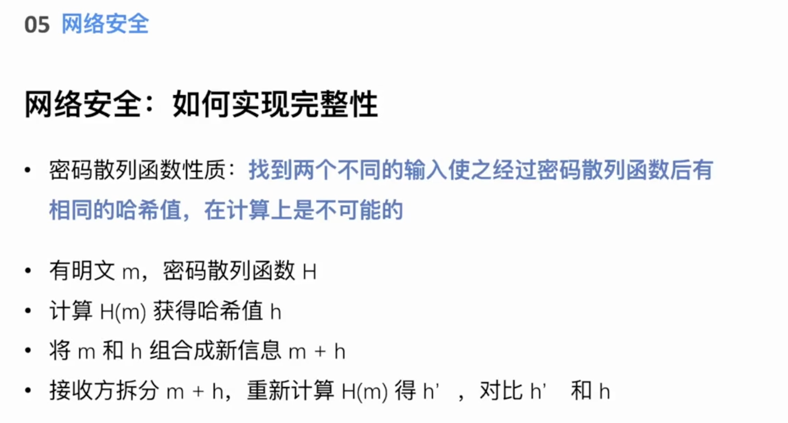

- 密码散列函数（Hash）性质：找到两个不同的输入使之经过密码散列函数后有相同的哈希值，在计算上是不可能的

方法一（漏洞百出）：

- 有明文m，密码散列函数 H

- 计算 H(m)获得哈希值h

- 将m 和 h 组合成新信息 m + h

- 接收方拆分 m + h，重新计算 H(m) 获得 h'，对比 h' 和 h

但如果攻击者改了m，重新计算 h,组成了新的 m+h，对方不就发现不了消息被篡改过了么，如果全是明文，这个方法没有任何防止篡改的作用。

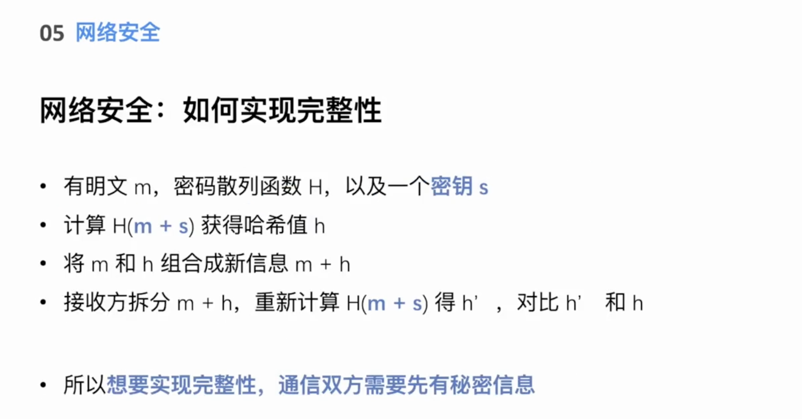

但假设双方有一个攻击者不知道的秘密信息 s (密钥)。

方法二：

- 有明文m，密码散列函数 H，以及一个**密钥 s**

- 计算 H(**m+s**)获得哈希值h

- 将m 和 h 组合成新信息 m + h

- 接收方拆分 m + h，重新计算 H(**m+s**) 获得 h'，对比 h' 和 h

如果攻击者修改了m，但并不知道s，那么将无法计算出正确的Hash 值，因此无法进行篡改。

所以**想要实现完整性，通信双方需要先有秘密信息**

### 如何实现身份验证

- 签名：用于鉴别身份和防止伪造

- 非对称加密性质：加密、解密使用不同的密钥（公钥和私钥），而且公钥加密只能用私钥解密、私钥加密只能用公钥解密

- 蟹老板用自己的**私钥对信件进行加密**，并发送给海绵宝宝

- 海绵宝宝使用蟹老板的**公钥进行解密**，获得原文

- 保证了**机密性、完整性和身份验证**

数字签名需满足可鉴别、不可伪造的特性，可鉴别用于验证身份，不可伪造用于确保签名真的来自于签名所声明的人，而不是攻击者。

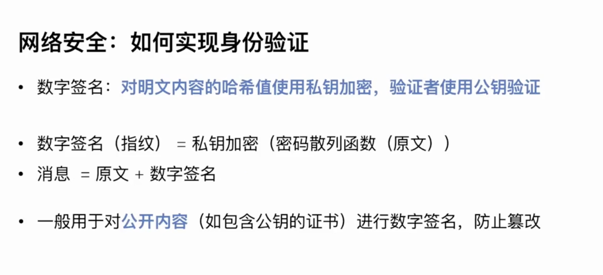

这样更像是加密而不像签名，使用非对称加密同时满足了机密性、完整性和身份验证。但非对称加密的计算效率太低，常用的方案是对内容进行密码散列函数后得到的hash值进行加密，获得数字签名，也被称为指纹。将数字签名附在信件后面，对方收到后使用公钥进行解密，获得Hash值，再将其与信件内容计算后的Hash值进行对比，如果一致，说明没有被篡改过。

- 一般用于对公开内容（如包含公钥的证书）进行数字签名，防止篡改。

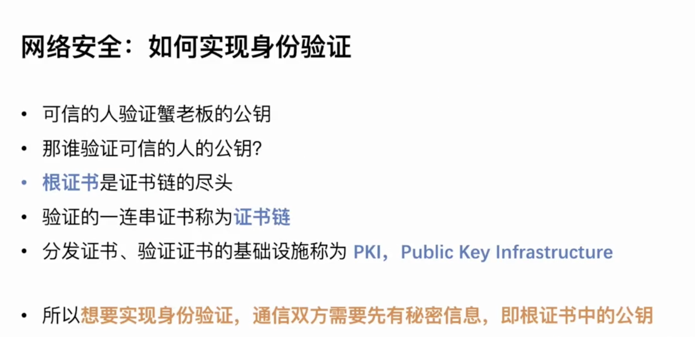

签名能正常运行的前提：

- 可信的人验证蟹老板的公钥（而不是被痞老板掉包）

- 那谁验证可信的人的公钥？根证书

数字签名验证的公钥和公钥对应的身份即为证书，验证一连串的证书称为证书链。对于整套证书的分发、撤销的体系可以看做是公钥的基础测试，缩写为PKI Public Key Infrastructure

- 所以 想要实现身份验证，通信双方需要先有秘密信息，即根证书的公钥。

有了这个公钥，即可在不安全的信道上，使用公钥和私钥加密交换机密性所需的秘密信息，即上文的密钥。也可以交换完整性所需的秘密信息，即计算Hash 值时的密钥s。

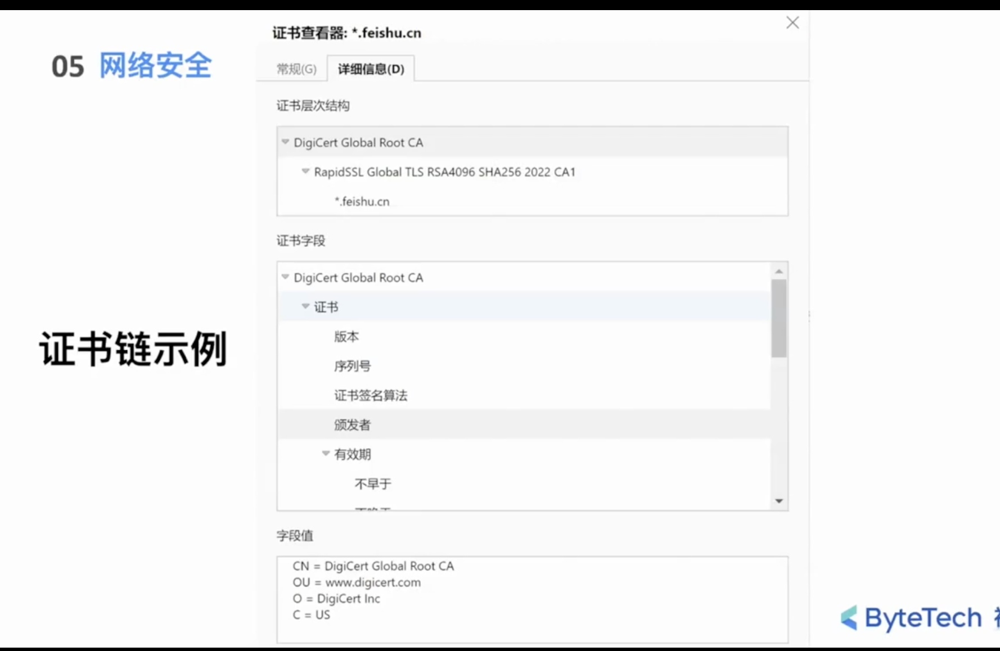

DigiCert Global Root CA 是根证书，然后在由Rapid SSL的证书验证 feishu.com 的证书有效，则feishu 的公钥就是真公钥。

### 网络安全：HTTPS

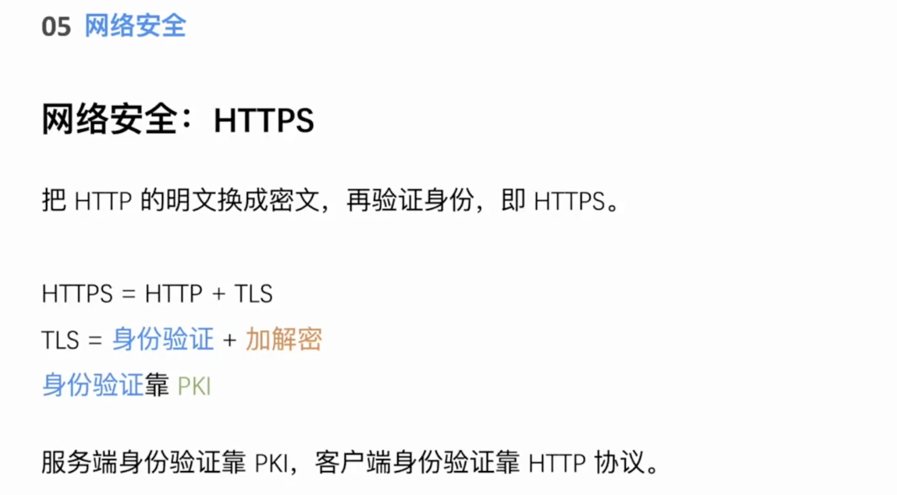

有了PKI 我们就可以实现基于明文的 HTTP 协议的安全通信，即HTTPS。

为了实现HTTPS，我们需要：

1. 使用PKI对服务器提供的证书进行验证

2. 使用验证后的证书中的公钥与服务器交换对称加密算法和密钥

3. 使用协商好后的对称密钥的算法和密钥，对明文进行加密

回顾HTTPS的流程：

客户端验证了服务器提供的证书，客户端可以确认服务端的身份，但服务端并不知道和他通信的客户端到底是谁。

如何验证客户端身份：

对于客户端验证身份是靠HTTP应用层解决的，例如使用feishu登录，登录需要账号密码，客户端验证后把用于身份验证的信息通过HTTPS传输给客户端，最常见的是 Cookie。下次客户端发送HTTPS请求之后，再发送秘密信息，服务端就可以知道客户端身份了。

补充：

服务端也可以要求客户端提供证书，这样就可以省去登录的一环，但很麻烦，现实几乎没有。

### 小结：

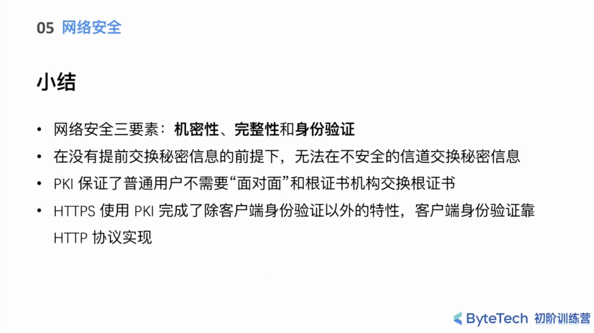

PKI 保证了你的系统中预置了可信任根证书，所有网站都会找其中一个根证书或者根证书所授权的中间证书签名，客户端拿到一个网站的证书后，挨个向证书链上的签发者验证证书的合法性，一直到根证书为止。如果根证书确认了次一级证书的签名，通过证书信任的传递性，最底层的网站证书就是可信的。如果证书链中最后一张证书在系统的根证书列表中找不到，那么这张证书就不能被信任，验证的服务器证书的有效性后，客户端使用证书中的公钥，通过非对称性加密，与服务端交换非对称性加密的算法和密钥，并使用该对称密钥对后续HTTP报文进行加密。服务端在通过要求客户端提供用户名和密码等信息，对客户端进行身份验证。至此，双方的通信收到保障，通信信息中间人无法篡改。

---

## 计算机网络思维导图：

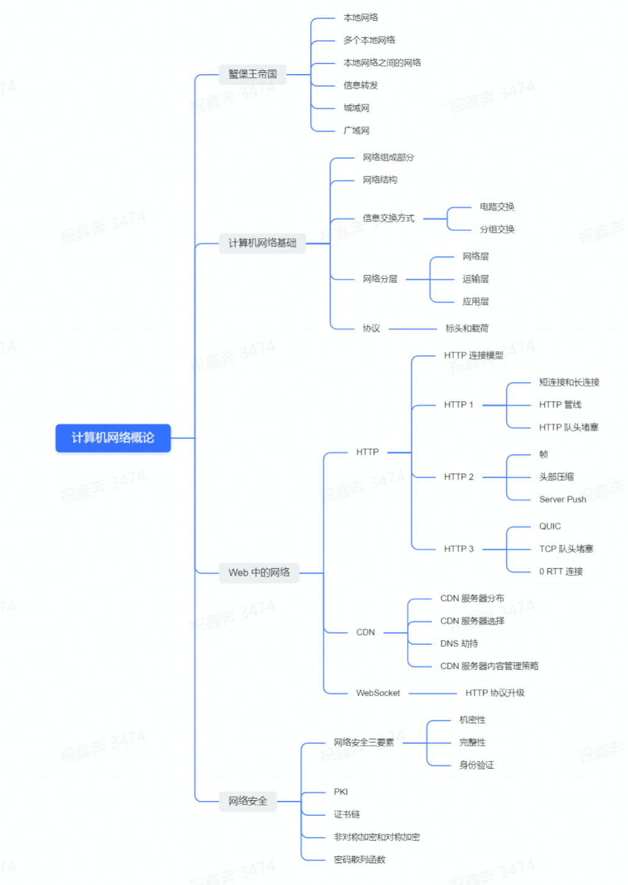

蟹堡王帝国：如何从本地网络一步步搭建起一个遍布全国的广联网。

 计算机网络基础：主要包含网络组成、网络结构、信息交换方式、网络分层和协议集部分。

---

### 参考文献和书籍推荐

- 计算机网络（原书第7版），机械工业出版社

- HTTP权威指南，人民邮电出版社

- 密码编码学与网络安全（第6版），垫子工业出版社

- https://calendar.perfplanet.com/2020/head-of-line-blocking-in-quic-and-http-3-the-details/

- https://calendar.perfplanet.com/2020/head-of-line-blocking-in-quic-and-http-3-the-details/
